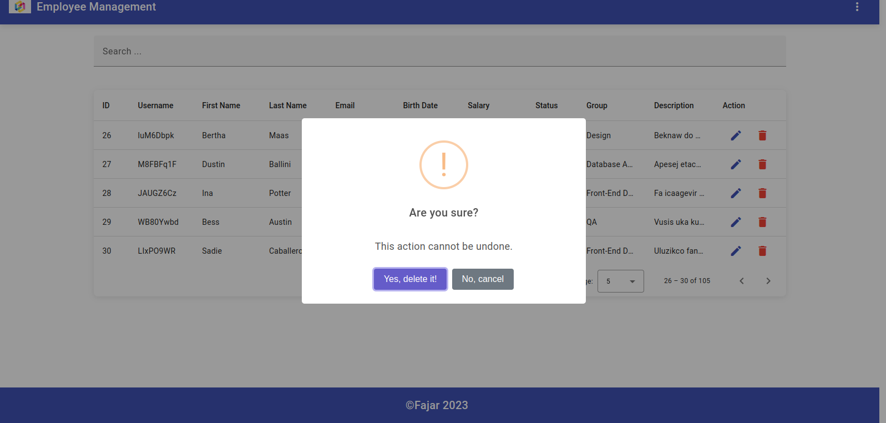

# Employee-Management

Aplikasi ini merupakan mini project Employee-Management yang menggunakan Angular v16, Material Angular io dan menggunakan JSON.SERVER untuk membuat 100 data dummy secara acak. 

## Development server

Jalankan `ng serve` untuk server dev. Arahkan ke `http://localhost:4200/`. Aplikasi akan dimuat ulang secara otomatis ke halaman login.
Jangan lupa juga untuk menjalankan Json Servernya di terminal dengan menjalankan 'json-server --watch db.json', untuk memanggil data jsonya untuk di tampilkan di Employee-list.
ketika aplikasi dijalankan, akan lansung di arahkan ke halaman login.

Masukkan email dan password sebagai berikut :
email :  admin@gmail.com
password : 123456

setelah berhasil login, dengan email dan password yang sesuai akan lansung diarahkan ke halaman employee-list.

## Employee

ketika sudah masuk ke halaman employee-list, akan ditampilkan semua data employee. di header pojok kanan tepatnya di icon more_vert, jika di klik akan ada 2 pilihan, 
yaitu pertama dapat menambahkan employee-form dan kedua dapat logout. kententuan untuk penambahan data employee, ketika melakukan penambahakan diharapkan harus mengisi semua jika ada yang masih kosong akan menampilkan error dan untuk tombol save nya juga akan disable (tidak bisa diklik).
untuk bagian birthDate tidak boleh diisi melebihi hari untuk saat ini, jika di lakukan akan manampilkan pesan error ketika dilakukan save secara paksa.

untuk bagian employee-list terdapat action edit dan delete, jika ingin melakukan delete data employee akan menampilkan sebuah pesan konfirmasi, untuk action edit
akan menampilkan sebuah detail employee data tersebut, dan di situ juga dapat melakukan update, jika ingin mengupdate juga akan menampilkan pesan konfirmasi. jika sudah melakukan pesan
konfirmasi delele maupun edit akan lansung kembali ke empolyee-list. untuk pagination terdapat pilihan page, bisa menampilkan 5 baris 10 baris sesuai pemilihan page sesuai kebutuhan. 

## appearance

## Build

Run `ng build` to build the project. The build artifacts will be stored in the `dist/` directory.

## Running unit tests

Run `ng test` to execute the unit tests via [Karma](https://karma-runner.github.io).

## Running end-to-end tests

Run `ng e2e` to execute the end-to-end tests via a platform of your choice. To use this command, you need to first add a package that implements end-to-end testing capabilities.

## Further help

To get more help on the Angular CLI use `ng help` or go check out the [Angular CLI Overview and Command Reference](https://angular.io/cli) page.
